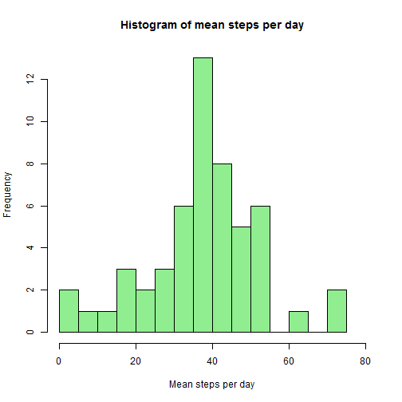
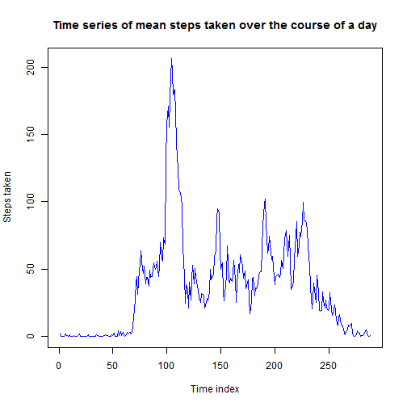
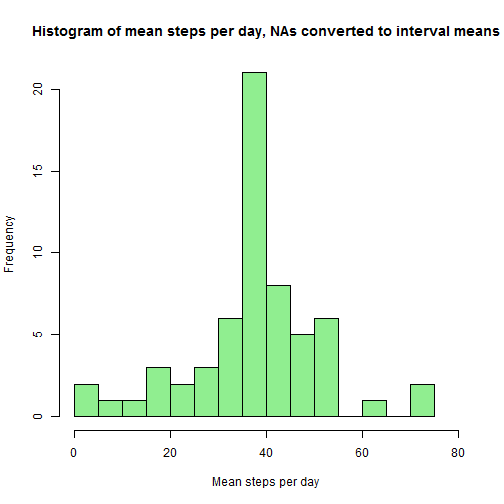
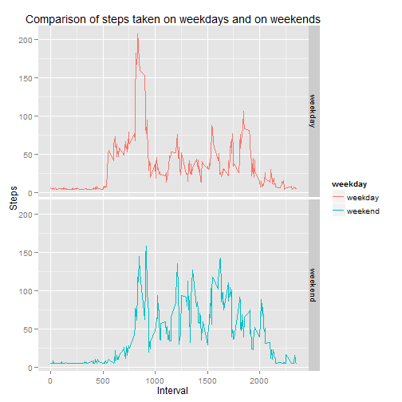

### Getting the data


```r
steps <- read.csv("c:/activity.csv")
head(steps); str(steps)
```

```
##   steps       date interval
## 1    NA 2012-10-01        0
## 2    NA 2012-10-01        5
## 3    NA 2012-10-01       10
## 4    NA 2012-10-01       15
## 5    NA 2012-10-01       20
## 6    NA 2012-10-01       25
```

```
## 'data.frame':	17568 obs. of  3 variables:
##  $ steps   : int  NA NA NA NA NA NA NA NA NA NA ...
##  $ date    : Factor w/ 61 levels "2012-10-01","2012-10-02",..: 1 1 1 1 1 1 1 1 1 1 ...
##  $ interval: int  0 5 10 15 20 25 30 35 40 45 ...
```
At this stage the NAs have to be removed, and the date column has to be converted from a factor class to a date class object:


```r
steps$date <- as.Date(steps$date,format="%Y-%m-%d")
steps1 <- na.omit(steps)
head(steps1)
```

```
##     steps       date interval
## 289     0 2012-10-02        0
## 290     0 2012-10-02        5
## 291     0 2012-10-02       10
## 292     0 2012-10-02       15
## 293     0 2012-10-02       20
## 294     0 2012-10-02       25
```

### Mean steps per day

A histogram will be calculated, showing the average number of steps taken per day.  To find the average, the aggregate() function will be used:

```r
agg <- aggregate(steps ~ date,mean,data=steps1)
hist(agg$steps,col="lightgreen",xlab="Mean steps per day", xlim=c(0,80),main="Histogram of mean steps per day",breaks=12)
```

 

```r
# the following variables are created to create in-text values for the mean and median, as seen immediately below this R code.
aggmean <- mean(agg$steps);aggmed <- median(agg$steps)
```
The mean number of steps taken per day is 37.3826 and the median number of steps taken per day is 37.3785.

### The average daily activity pattern

The aggregate() function will be used again, to see which intervals, across all days, have the most activity.  In the first instance a time series chart will be created.

```r
agg2 <- aggregate(steps ~ interval,mean,data=steps1)
plot(agg2$steps,cex=0.2,col="blue",type="l",xlab="Time index",ylab="Steps taken",main="Time series of mean steps taken over the course of a day")
```

 

### Inputting missing values

A number of the values for the number of steps are missing:

```r
summary(steps$steps)
```

```
##    Min. 1st Qu.  Median    Mean 3rd Qu.    Max.    NA's 
##     0.0     0.0     0.0    37.4    12.0   806.0    2304
```
Overall, there are 2304 steps missing.  The NA values for these steps are going to be replaced with the mean value for the particular interval.

```r
replaceNA <- function(x){
  if (is.na(steps$steps[x])){
    steps3 <- subset(steps1,interval=steps$interval[x])
    steps$steps[x] <<- mean(steps3$steps)
    }
  }
length1 <- dim(steps)[1]
ff <- sapply(1:length1,replaceNA)

agg <- aggregate(steps ~ date,mean,data=steps)
hist(agg$steps,col="lightgreen",xlab="Mean steps per day", xlim=c(0,80),main="Histogram of mean steps per day, NAs converted to interval means",breaks=12)
```

 

```r
aggmean <- mean(agg$steps);aggmed <- median(agg$steps)
```
The mean number of steps taken per day, for the dataset with the NAs filled in with means, is 37.3826 and the median number of steps taken per day is 37.3826.  Performing the substituion appears to make very little difference - it is noted that the mean and the median are exactly the same.  The histogram has a a very similar shape, although the central bar is higher.

### Do weekends make a difference?

First a new variable is created, for the day of the week.  Then another variable is created, which indicates whether or not it is the weekend, marked as weekday for Monday to Friday, weekend for Saturday through to Sunday.

```r
head(steps)
```

```
##   steps       date interval
## 1 37.38 2012-10-01        0
## 2 37.38 2012-10-01        5
## 3 37.38 2012-10-01       10
## 4 37.38 2012-10-01       15
## 5 37.38 2012-10-01       20
## 6 37.38 2012-10-01       25
```

```r
len4 <<- dim(steps)[1]
len4
```

```
## [1] 17568
```

```r
steps$weekday <- weekdays(steps$date)
steps$weekend <- rep("weekday",len4)

weekend<- function(x){
if(steps$weekday[x]=="Saturday"|steps$weekday[x]=="Sunday"){
  steps$weekend[x] <<- "weekend"
  }
}
  
 ff <- sapply(1:len4,weekend) 

steps$weekend <- as.factor(steps$weekend)
table(steps$weekend)
```

```
## 
## weekday weekend 
##   12960    4608
```

```r
week1 <- subset(steps,weekend=="weekday")
week2 <- subset(steps,weekend=="weekend")
wkday <- aggregate(steps ~ interval,mean,data=week1)
wkend <- aggregate(steps ~ interval,mean,data=week2)
wkday$weekday <- "weekday"
wkend$weekday <- "weekend"
stepsfinal <- rbind(wkday,wkend)
stepsfinal$weekday <-as.factor(stepsfinal$weekday)
```
A Graph was created, comparing the mean distribution of steps on weekdays and weekends.  The two graphs suggests that there are real differences - on weekends there appears to be much greater variability.  

```r
library(ggplot2)
```

```
## Warning: package 'ggplot2' was built under R version 3.1.2
```

```r
ggplot(stepsfinal,aes(x=interval,y=steps,colour=weekday)) + geom_line() + facet_grid(weekday ~ .) + labs(y="Steps",x="Interval") + ggtitle("Comparison of steps taken on weekdays and on weekends")
```

 
